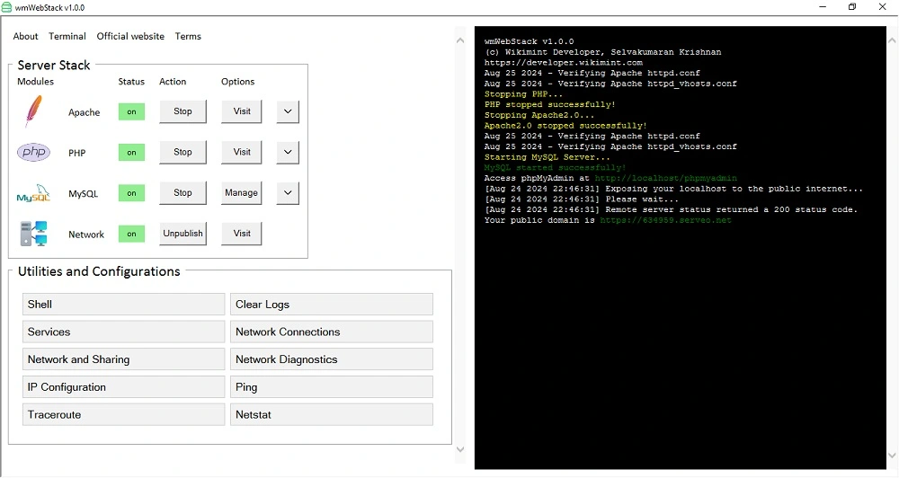

# Welcome to wmWebStack

**wmWebStack** is a free and installable software package that provides an all-in-one solution for web development on Windows. It includes an intuitive graphical interface that allows you to manage all essential web development tools and utilities with ease. Ideal for developers, testers, and anyone in need of an installable and easy-to-use server solution, wmWebStack offers a robust set of features without the complexity.

  <a href="https://github.com/wikimint/wmWebStack/releases/latest" target="_blank" style="background-color: #4CAF50; color: white; padding: 10px 20px; text-align: center; text-decoration: none; display: inline-block; border-radius: 5px;">Download</a>
  <a href="#documentation" style="background-color: #008CBA; color: white; padding: 10px 20px; text-align: center; text-decoration: none; display: inline-block; border-radius: 5px;">Documentation</a>

 
<a href="/version-log">View Version History</a>

 

## Features

- **Integrated Control Panel**: A user-friendly GUI with buttons to start and stop all modules like Apache, PHP, MySQL, and more.
- **Antivirus Integration**: Perform ClamAV antivirus scans directly from the control panel.
- **Serveo.net Publishing**: Easily publish your local server live with Serveo.net and manage public links.
- **Configuration Management**: Quick access to open and edit all configuration and INI files for Apache, PHP, MySQL, etc.
- **PHP Info**: Access detailed PHP configuration and status with a single click.
- **System Utilities**: Additional shortcuts for useful Windows system commands like `ipconfig`, `netstat`, `services.msc`, and more.

## Installation

1. Download the latest installer from [GitHub Releases](https://github.com/wikimint/wmWebStack/releases).
2. Run the installer and follow the on-screen instructions.
3. After installation, a shortcut to **wmWebStack** will appear on your desktop.

## How to Use

1. Launch **wmWebStack** using the desktop shortcut.
2. Use the GUI to start and stop services like Apache, PHP, MySQL, and perform other tasks.
3. Access configuration files, server status, and more through the available shortcuts.
4. Use the built-in options to publish your local site via Serveo.net, or run an antivirus scan with a click.

## Documentation

- **[Getting Started Guide](https://webstack.wikimint.com/docs/getting-started)**
- **[Module Configuration](https://webstack.wikimint.com/docs/configuration)**
- **[FAQ](https://webstack.wikimint.com/docs/faq)**

## About the Developer

**Selvakumaran Krishnan** is a Software Developer and Computer Programmer. With extensive experience in web technologies, Selvakumaran created **wmWebStack** to streamline web development on Windows by combining all necessary tools in one easy-to-use package. Connect with him on [LinkedIn](https://www.linkedin.com/in/selvakumaran-krishnan).

## License

**wmWebStack** is freeware. You are free to use and distribute the software, but the source code is not available for modification or redistribution. For more details, refer to the [EULA](https://webstack.wikimint.com/eula).

## Contact

For any inquiries or support, please reach out via [email](mailto:support@wikimint.com) or visit our [Support Page](https://developer.wikimint.com/p/contact.html).

## Latest Blog Posts

<ul>
  
    <li>
      <a href="{{ post.url | absolute_url }}">{{ post.title }}</a>
      
{{ post.excerpt | strip_html | truncate: 150 }}

      
<small>Published on {{ post.date | date: "%B %d, %Y" }}</small>

    </li>
  
</ul>
